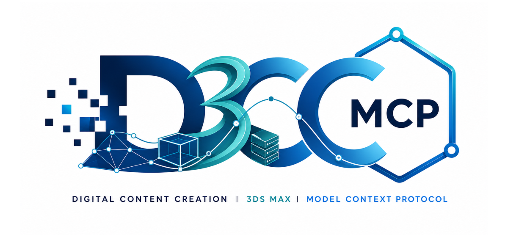

# dcc-mcp-3dsmax

<p align="center">
  
</p>

3ds Max plugin for the DCC Model Context Protocol (MCP) ecosystem.

## Agent workflow

Choose the connection path that matches your client:

- **Shell or headless agent:** use `dcc-mcp-cli` through the shared gateway.
- **IDE MCP client:** connect to `http://127.0.0.1:9765/mcp`.
- **3ds Max setup:** follow [`install.md`](install.md) to install the runtime
  and startup hook.

Prefer typed skills and tools over raw scripts.

### Install and update the CLI

If `dcc-mcp-cli` is missing, obtain user consent before installing the official
release:

```bash
# Linux/macOS
curl -fsSL https://raw.githubusercontent.com/dcc-mcp/dcc-mcp-core/main/scripts/install-cli.sh | sh

# Windows PowerShell
powershell -ExecutionPolicy Bypass -c "irm https://raw.githubusercontent.com/dcc-mcp/dcc-mcp-core/main/scripts/install-cli.ps1 | iex"
```

Check for updates, then stage the latest CLI for the next launch:

```bash
dcc-mcp-cli update check
dcc-mcp-cli update apply
```

`update apply` stages the CLI only. It does not update a running
`dcc-mcp-server`; update that server in its own environment.

## Features

- **Sidecar MCP Server**: Starts `dcc-mcp-server.exe sidecar` and keeps 3ds Max scene edits on the main thread
- **Progressive Skill Loading**: Discover skills without loading them immediately
- **Shared Gateway**: Registers with the stable gateway at `http://127.0.0.1:9765/mcp`
- **Job Persistence**: SQLite-based job storage for long-running operations
- **Prometheus Metrics**: Optional `/metrics` endpoint for monitoring

## Agent install (recommended)

The fastest way to install is to let your AI agent do it. In Cursor, Claude, or
any MCP-capable agent host, ask:

```text
Please install and verify dcc-mcp-3dsmax.

First clone or locate the dcc-mcp-3dsmax repository and resolve its absolute
path as REPO_ROOT. Then read these absolute-path files before making changes:

- <REPO_ROOT>\install.md
- <REPO_ROOT>\skills\dcc-mcp-3dsmax-setup\SKILL.md

Follow the setup skill exactly:

1. Locate my 3dsmaxpy.exe. If it cannot be found, ask me for the absolute path.
2. Install dcc-mcp-3dsmax and dependencies. Prefer PyPI for end-user installs;
   use the local checkout only when I am already working from REPO_ROOT.
3. Install the 3ds Max startup hook so opening or restarting 3ds Max starts
   the runtime automatically.
4. Generate MCP Streamable HTTP config pointing to http://127.0.0.1:9765/mcp.
5. Ask me to open or restart 3ds Max, then run the generated smoke prompt to
   prove the agent can discover and call typed 3ds Max tools.
```

The agent reads [`install.md`](install.md), runs the setup script against your
3ds Max `3dsmaxpy.exe`, installs a startup hook, generates the MCP host config,
asks you to open or restart 3ds Max, and runs a live smoke prompt to confirm
the connection.

## Installation

```bash
pip install dcc-mcp-3dsmax
```

## Quickstart (inside 3ds Max MAXScript Listener)

```python
import dcc_mcp_3dsmax

# Start on a random instance port; the public gateway stays fixed.
server = dcc_mcp_3dsmax.start_server()

# Progressive loading — discover skills without loading them immediately
n = server.discover_skills()        # scan paths, register tool metadata
server.load_skill("3dsmax-scene")  # lazy-load a specific skill

dcc_mcp_3dsmax.stop_server()
```

## Runtime Bridge

Start the runtime bootstrap inside 3ds Max:

```maxscript
python.ExecuteFile @"C:\path\to\dcc-mcp-3dsmax\examples\start_sidecar_bridge.py"
```

This starts the agent-callable embedded MCP runtime, registers bundled 3ds Max
skills/tools, and routes main-affinity scene edits through the shared
`dcc-mcp-core` 0.19.45 UI dispatcher, pump abstractions, gateway guardian, dynamic instance ports, and six-state
readiness probe (process, dispatcher, dcc, skill_catalog, host_execution_bridge,
main_thread_executor). The legacy
random-port `/dispatch` bridge remains available for local diagnostics. The
3ds Max instance is registered with the stable gateway at
`http://127.0.0.1:9765/mcp`.
See `docs/SIDECAR.md` and the bundled skill index in
`docs/BUNDLED_SKILLS.md`.

The bootstrap also installs a `DCC MCP` menu with Start Server, Stop Server,
Open Gateway Admin, and Print Status commands. 3ds Max shutdown triggers the
same stop path via `#preSystemShutdown`, so the runtime and local bridges are
cleaned up when the host exits.

## Skill Development

Create a skill with `SKILL.md` metadata file and Python scripts:

```python
# my_skill/action_create_box.py
from dcc_mcp_3dsmax.api import max_success, with_max

@with_max
def main(width: float = 100.0, height: float = 100.0, depth: float = 100.0) -> dict:
    import pymxs
    rt = pymxs.runtime

    box_obj = rt.Box(width=width, height=height, depth=depth)
    return max_success("Created box", object_name=str(box_obj))
```

## Environment Variables

| Variable | Description | Default |
|----------|-------------|---------|
| `DCC_MCP_3DSMAX_METRICS` | Enable Prometheus `/metrics` endpoint | `0` |
| `DCC_MCP_3DSMAX_JOB_STORAGE` | Path to SQLite job database | platform default |
| `DCC_MCP_3DSMAX_DISABLE_EXECUTE_PYTHON` | Disable `execute_python` tool | `0` |
| `DCC_MCP_3DSMAX_DISABLE_ARBITRARY_SCRIPT` | Disable all arbitrary script execution | `0` |
| `DCC_MCP_3DSMAX_ENABLE_GATEWAY_FAILOVER` | Enable gateway failover | `1` |
| `DCC_MCP_3DSMAX_SKILL_PATHS` | Extra skill search paths (semicolon-separated) | None |
| `DCC_MCP_3DSMAX_BRIDGE_PORT` | Runtime bridge localhost port | random |
| `DCC_MCP_3DSMAX_BOOTSTRAP_PATHS` | Extra package Python roots for startup bootstrapping | None |
| `DCC_MCP_PYTHONPATHS` | Shared package Python roots for Rez/pipeline launchers | None |
| `DCC_MCP_3DSMAX_ROOT` | Adapter package root; startup probes `python`, `python37`, `src`, and root | None |
| `DCC_MCP_CORE_ROOT` | `dcc-mcp-core` package root; startup probes `python`, `python37`, `src`, and root | None |
| `DCC_MCP_SERVER_ROOT` | Fallback `dcc-mcp-server` package root for Rez/pipeline launches | None |
| `DCC_MCP_SERVER_BIN` | Explicit `dcc-mcp-server` executable path for sidecar mode | bundled payload |
| `DCC_MCP_REGISTRY_DIR` | Optional shared gateway/sidecar registry override | core default |

Normal MZP installs do not need `DCC_MCP_3DSMAX_PORT` or
`DCC_MCP_GATEWAY_PORT`: the adapter uses an internal ephemeral MCP port and the
shared gateway default.

For Rez-style deployment, launch 3ds Max with package roots in the environment
instead of copying packages into the user scripts folder. A pipeline package
cache can expose paths such as `<package-cache>/dcc_mcp_core`,
`<package-cache>/dcc_mcp_3dsmax`, and `<package-cache>/dcc_mcp_server`
through the root variables above.
The MZP installer uses isolated version directories under
`<user scripts>/dcc_mcp_3dsmax/versions/`, so installing a new payload does not
delete the version that may already be loaded by the running 3ds Max process.
After install, the active payload is added to `sys.path`, obsolete payload
directories are cleaned up where possible, and the runtime is started. The
generated startup script repeats that activation on future 3ds Max launches, so
the bridge comes back automatically after restart.
Uninstall cleanup uses the import-light lifecycle helpers from `dcc-mcp-core`
when available, so locked native files are reported as restart-required instead
of disappearing into a generic `PermissionError`.

## Requirements

- 3ds Max 2017 or later (Python 3.x with pymxs support)
- Python >= 3.7
- dcc-mcp-core >= 0.19.45
- dcc-mcp-server >= 0.19.45

## License

MIT

